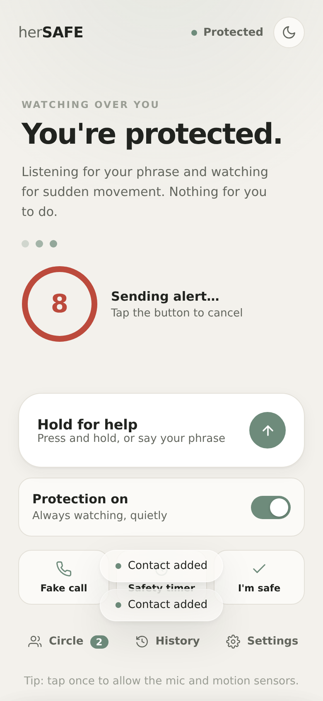
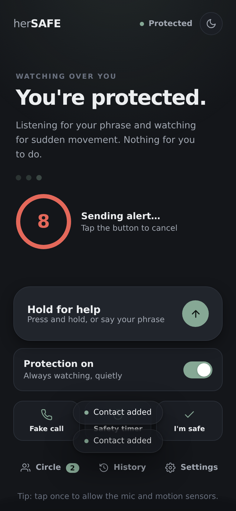
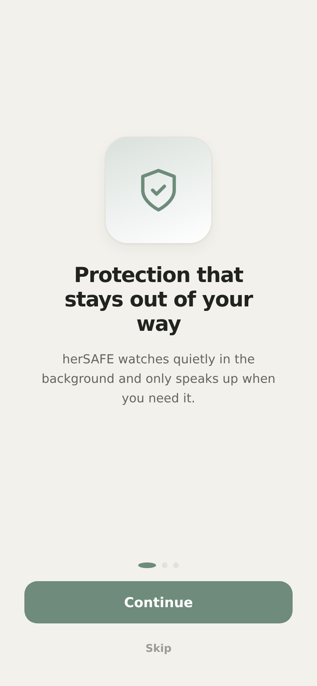
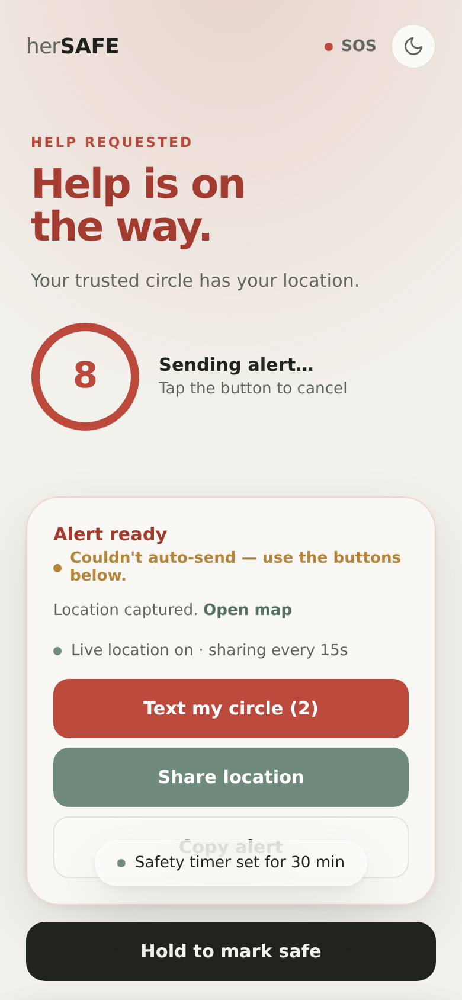
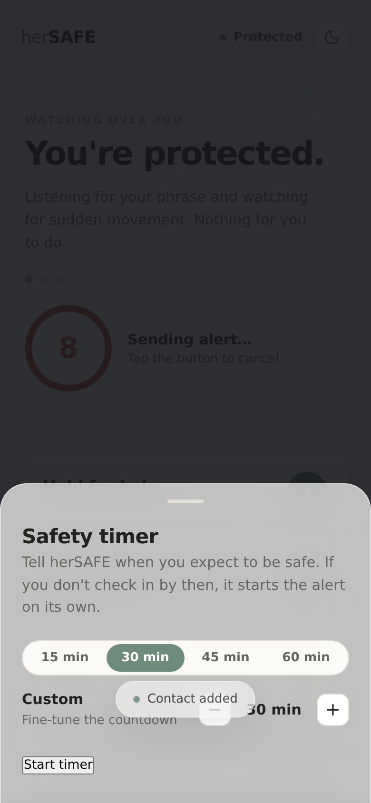
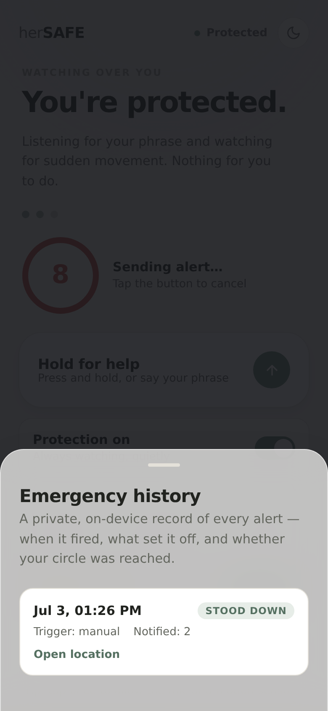

# herSAFE

**Quiet, hands-free personal safety — a production-grade Progressive Web App.**

herSAFE watches over you in the background and reaches your trusted circle the moment something goes wrong. It activates on a spoken phrase, a hard shake, or a press-and-hold — then shares your live location, notifies your people across multiple channels, and can record audio and blink your flashlight as evidence and a beacon. It installs like a native app and works offline.

> Designed as *invisible infrastructure*: it stays out of your way until the instant you need it.

---

## Screenshots

| Home (light) | Home (dark) | Onboarding |
|---|---|---|
|  |  |  |

| Emergency | Safety timer | History |
|---|---|---|
|  |  |  |


---

## Features

**Detection & activation**
- Voice trigger (Web Speech API) — say your custom phrase
- Shake detection (Device Motion API) with a debounced jerk/peak model
- Press-and-hold manual SOS
- A four-state engine — `idle → elevated → confirming → triggered` — with a cancellable countdown to prevent false alarms

**When an emergency fires**
- **Live location tracking** — position shared every 15s until you're safe
- **Multi-channel dispatch** — Twilio SMS, ntfy.sh / Discord / custom webhooks, and email (Resend)
- **Emergency audio recording** — uploads if storage is configured, otherwise saved locally
- **Flashlight SOS** — blinks the torch on supported devices
- Manual fallbacks always available: SMS deep-link, Web Share, copy-to-clipboard

**Everyday tools**
- **Trusted circle** — add/edit/delete contacts, mark a primary, phone validation
- **Fake incoming call** — configurable caller, delay, and synthesized ringtone to exit an uncomfortable situation
- **Safety timer** — "home in 30 min"; auto-escalates if you don't check in
- **Safe check-in** — one tap to tell your circle you're okay
- **Emergency history** — a private on-device log: time, trigger, location, contacts notified, delivery status

**Platform**
- Installable PWA with offline app shell (service worker)
- Light / dark / system theme
- Onboarding, toasts, skeleton loaders, accessible bottom sheets

---

## Architecture

herSAFE is a dependency-free ES-module app with a small serverless backend. The guiding rule: **services and the state machine never touch the DOM; the UI never mutates state directly.** They communicate through a tiny event bus, which keeps the engine testable and features easy to add.

```
index.html
├─ styles/
│  ├─ tokens.css        design system — color, type, motion (light + dark)
│  └─ app.css           components & screens
├─ src/
│  ├─ config.js         enums, defaults, tunables, copy
│  ├─ store.js          versioned, namespaced persistence (+ in-memory fallback)
│  ├─ emitter.js        pub/sub event bus
│  ├─ state.js          SafetyMachine — the finite state machine (DOM-free)
│  ├─ dom.js            XSS-safe element builder + helpers
│  ├─ theme.js          light / dark / system
│  ├─ utils/util.js     phone validation, sanitisation, haptics
│  ├─ services/         siren · location · sensors · dispatch   (device + network)
│  ├─ features/         fakeCall · safetyTimer · recorder · flashlight
│  ├─ ui/               home · emergency · contacts · settings · tools ·
│  │                    onboarding · sheets · toast · log
│  └─ main.js           composition root — wires everything, contains no logic
├─ api/
│  ├─ alert.js          POST /api/alert  — fan-out to SMS / webhook / email
│  └─ upload.js         POST /api/upload — optional evidence storage
├─ sw.js                service worker (offline shell, network-first nav)
├─ manifest.webmanifest
└─ test/                node --test unit tests (state machine + utils)
```

**Data flow (an alert):** a sensor reports intent → `SafetyMachine.to()` applies the transition rules → emits `state:trigger` → `ui/emergency.js` captures location, records an incident, renders the panel, and calls `services/dispatch.js` → the serverless function fans the message out to every configured channel and returns a per-channel result the UI reflects live.

---

## Tech Stack

- **Frontend:** Vanilla JavaScript (ES modules), HTML, CSS custom properties — no framework, no build step
- **Web platform APIs:** Web Speech, Device Motion, Geolocation, MediaRecorder, MediaStream (torch), Web Audio, Vibration, Web Share, Service Worker
- **Backend:** Vercel Serverless Functions (Node 18+, zero npm dependencies)
- **Integrations:** Twilio (SMS), ntfy.sh / Discord / custom webhooks, Resend (email), optional Vercel Blob (recordings)
- **Testing:** Node's built-in test runner (`node --test`)

---

## Installation

```bash
git clone https://github.com/<you>/hersafe.git
cd hersafe
```

No dependencies are required to run the app itself.

## Local Development

ES modules must be served over HTTP (not `file://`):

```bash
npm run dev          # python3 -m http.server 8137
# then open http://localhost:8137
```

Run the tests:

```bash
npm test             # node --test
```

For full functionality (mic, motion, geolocation) browsers require a **secure context** — `localhost` counts, or use HTTPS in production.

## Deployment

Deploys to **Vercel** with zero configuration — static assets are served directly and everything in `/api` becomes a serverless function.

```bash
npm i -g vercel
vercel               # preview
vercel --prod        # production
```

Or push to GitHub and import the repo in the Vercel dashboard. The app works with **no** environment variables (using manual SMS/share fallbacks); add the variables below to enable automatic delivery.

## Environment Variables

All secrets live server-side only and are never exposed to the browser. Configure any subset in **Vercel → Project → Settings → Environment Variables**:

| Variable | Purpose |
|---|---|
| `TWILIO_ACCOUNT_SID` | Twilio SID (real SMS) |
| `TWILIO_AUTH_TOKEN` | Twilio auth token |
| `TWILIO_FROM` | Twilio sender number |
| `ALERT_WEBHOOK_URL` | ntfy.sh topic, Discord webhook, or custom JSON sink |
| `RESEND_API_KEY` | Resend API key (email) |
| `ALERT_EMAIL_TO` | Comma-separated recipient emails |
| `ALERT_EMAIL_FROM` | Verified sender (optional) |
| `BLOB_READ_WRITE_TOKEN` | Enables audio upload via Vercel Blob (optional) |

A per-user webhook can also be set in-app under **Settings → Alert webhook** — handy for ntfy.sh/Discord with no server config at all.

## Security & Accessibility

- **XSS-safe rendering** — all user data is inserted via `textContent`/attributes through an element builder, never string-concatenated HTML.
- **Input validation** — phone numbers validated and normalised client- and server-side; API clamps message length, contact count, and validates webhook URLs.
- **No exposed secrets** — integration credentials stay in serverless env vars.
- **Accessibility** — semantic roles, ARIA labels, `aria-live` status regions, focus management and Escape-to-close on sheets, keyboard-operable controls, large touch targets, and `prefers-reduced-motion` support.

## Future Scope

- Native background detection via an Expo/React Native shell (browser voice only runs foreground)
- End-to-end encrypted location links and short-lived share tokens
- Fall detection and geofenced auto-arming
- Trusted-contact companion view with a live map
- Internationalisation / multi-language phrases

## License

MIT
